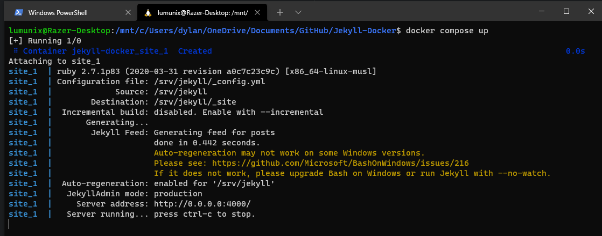
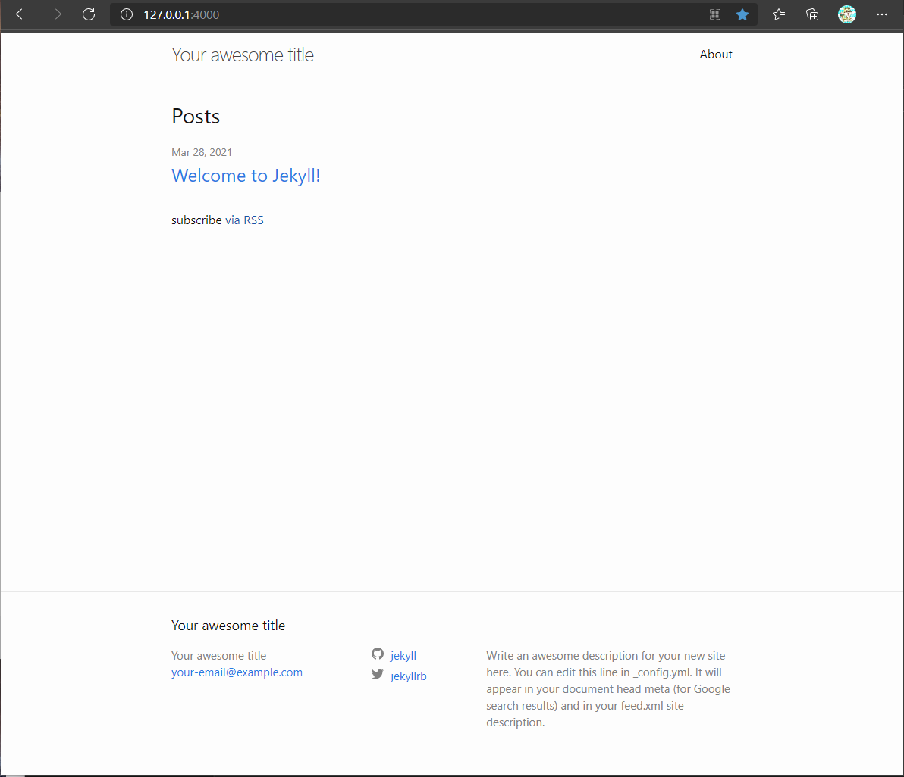
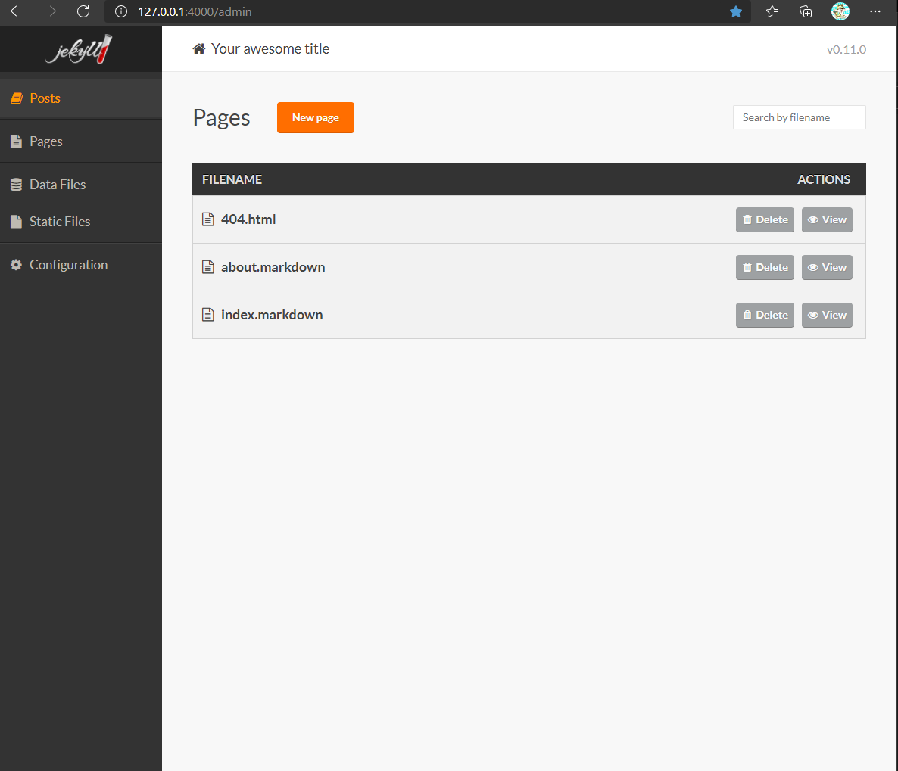

# Jekyll-Docker - Jekyll blog template in a docker container with Jekyll Admin CMS.


## About

This template repository provides an example of a Jekyll blog with Docker Compose. By using docker you can have a consistent environment across computers and you don't have to deal with installing ruby and its dependencies. The Jekyll plugin [Jeykll Admin](https://github.com/jekyll/jekyll-admin) is also present, which allows a CMS (Content Management System) experience similar to Wordpress.

## Usage

1. [Install Docker/Compose](https://docs.docker.com/compose/install/). You must have Docker and Compose installed.

2. Create your own copy of this repo using Github's Repository template feature. Clone it to your machine.

3. In the directory you downloaded the project, open command line or terminal and run the following command.

```
docker-compose up
```


4. You should now be able to go to your web browser and view the site [Here](http://127.0.0.1:4000/)


5. The Jekyll admin console is available [Here](http://127.0.0.1:4000/admin)

